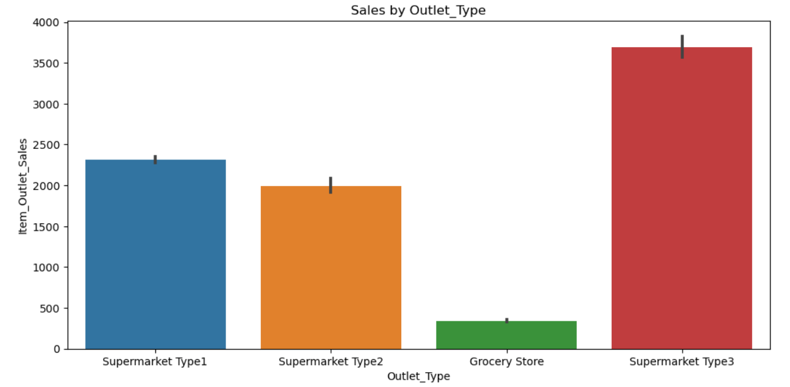
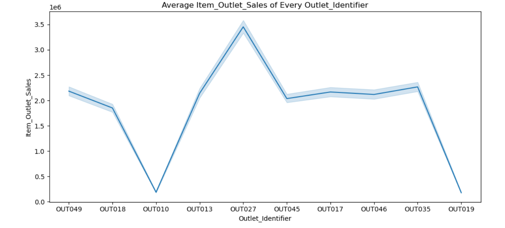
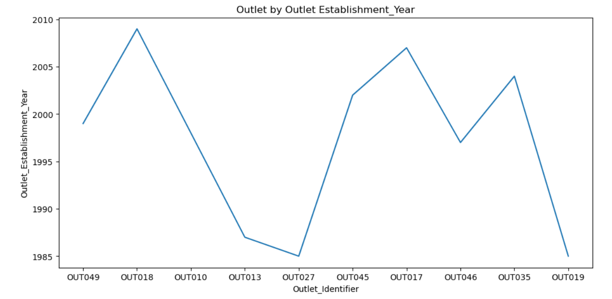
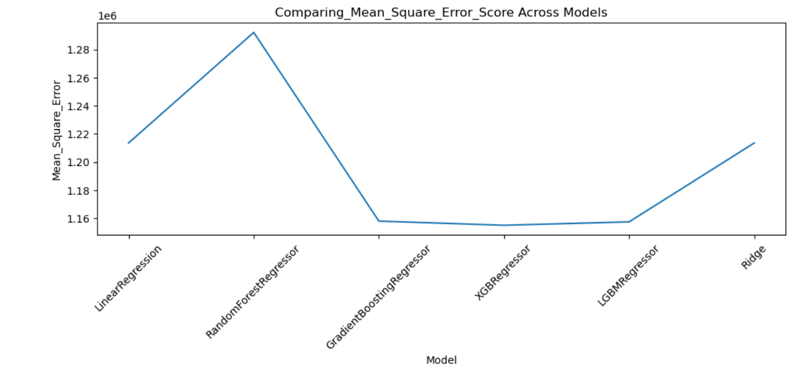

# Big-Mart-Sales-Prediction-Regression-Model-Comparison
Big Mart sales prediction using multiple regression models. Built and compared 7 models with R² and MSE metrics, along with detailed visualizations and feature analysis.

Project Overview

This project focuses on predicting sales for Big Mart outlets using historical sales and product data.
The goal is to apply different regression techniques, evaluate their performance, and determine the best-performing model.

A total of 7 regression models were trained and compared using:

Mean Squared Error (MSE)

R² Score

Visualizations were also created to better understand feature relationships, distributions, and model results.

##Sales_by_Outlet_Type

##Sales_by_Outlet_Distribution

##Avg_outlet_sales

##Item_Mrp_spread

##Outlet_by_Establishment_Year

Key Features

Data Preprocessing: Handling missing values, encoding categorical variables, feature scaling.

Exploratory Data Analysis (EDA): Distribution plots, correlation heatmaps, boxplots, and product/outlet insights.

Model Building: Applied 7 regression models including Linear Regression, Ridge, Lasso, Decision Tree, Random Forest, Gradient Boosting, and XGBoost.

Model Evaluation: Compared models based on MSE and R² score using bar graphs and charts.

Visualization: Clear plots to explain data patterns and prediction results.

## Mean_squared_Across_Model

## R2_Score_Models

